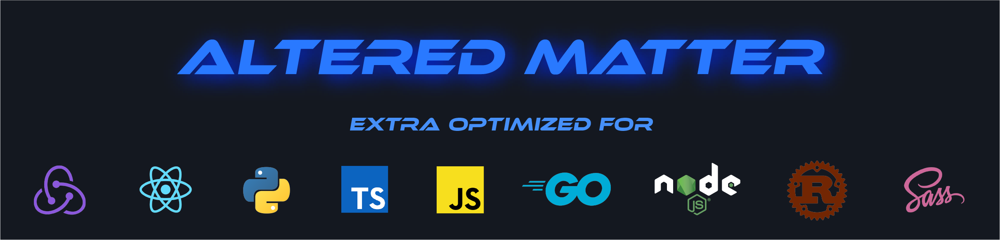

<h2 align=center>🚀 Altered Matter - Dark Theme 🚀</h2>
<p align=center style="font-style: italic">No modification needed, set and go!</p>
<h4 align=center> Choose your Template Color:</h4>
<h6 align=center>Without change the core Theme + Flat Option</h6>
<p align=center>
🔵 Blue | 🟢 Green | 🔴 Coral | 🟣 Pink | 🦉 Dopamin Owl
</p>
</br>
<h2 align=center>🔥Update🔥</h2>

* New theme update! A bonus theme for the dopamine addicts among us, with improved syntax highlighting, better contrast, and a dark environment. Inspired by Sarah Drasner's Night Owl Theme.
  * Neues Theme-Update! Ein Bonus-Theme für die Dopaminabhängigen unter uns, mit besserem Syntax-Highlighting, besserem Kontrast und dunkler Umgebung. Inspiriert von Sarah Drasners Night Owl Theme.

</br>
<h2 align=center>🖥 Installation:</h2>

*  Open Extensions sidebar panel in VS Code. View → Extensions.
    * Öffne Erweiterungen in der Seitenleiste im VS Code oder unter dem Menüpunkt Anzeige → Erweiterungen.
* Search for Altered Matter.
    * Suche nach Altered Matter.
* Click Install to install it.
    * Klicke auf installieren.
* Code → Preferences → Color Theme → Altered Matter or sidebar → panel → settings icon → Color Theme.
    * Code → Einstellungen → Farbschema → Altered Matter. Oder im VS Code auf der Seitenleiste unten auf das Zahnrad → Farbdesign.
* Optional: Use the recommended settings below for the best experience.
    * Optional: Benutze die von mir empfohlenen Einstellungen, siehe unten, um das best mögliche Ergebnis zu erzielen.
</br>

<h2 align=center>🧑‍💻 Usage:</h2>
<p align=center style="font-style: italic">
Select the Theme and happy coding! / Farbschema auswählen und happy coding!
</p>
</br>
<h3>Theme Colors:</h3>

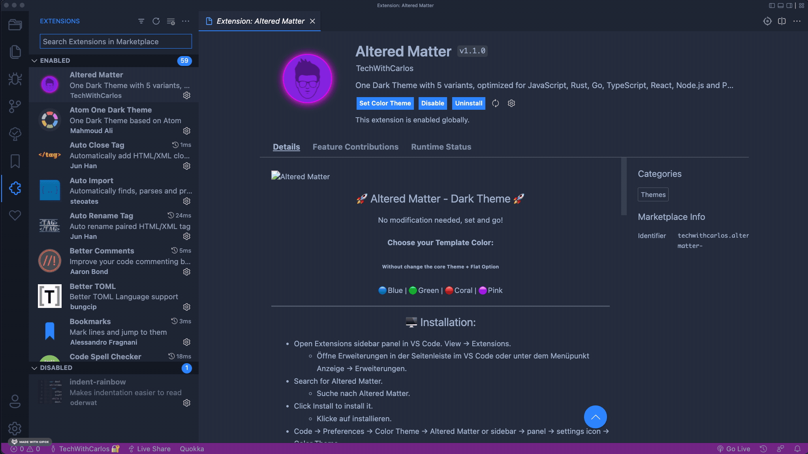
</br>
</br>

<h3>Altered Matter Default:</h3>

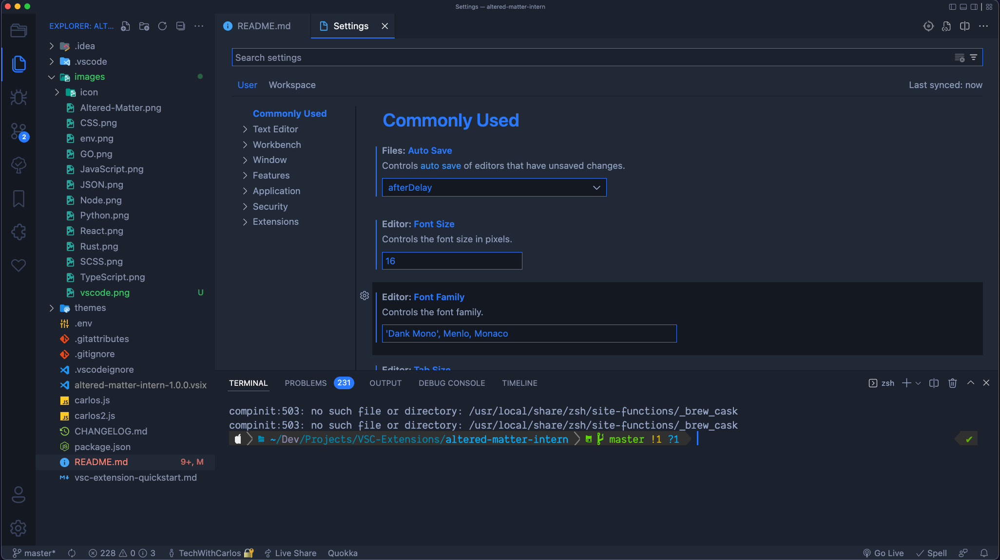
</br>
</br>
<h3>Node.js:</h3>


</br>
</br>
<h3>.env:</h3>

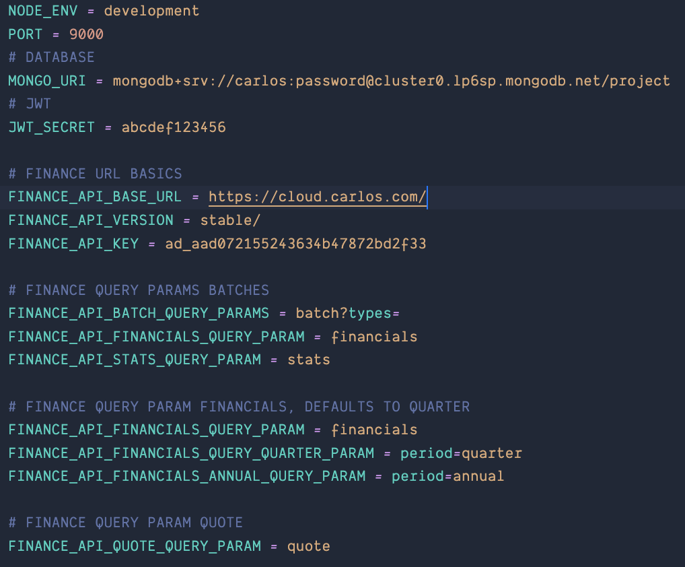
</br>
</br>
<h3>GO:</h3>

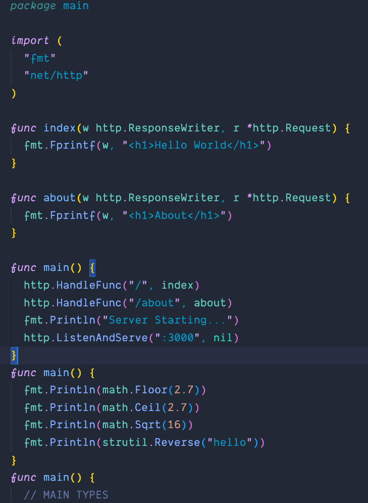
</br>
</br>
<h3>Rust:</h3>

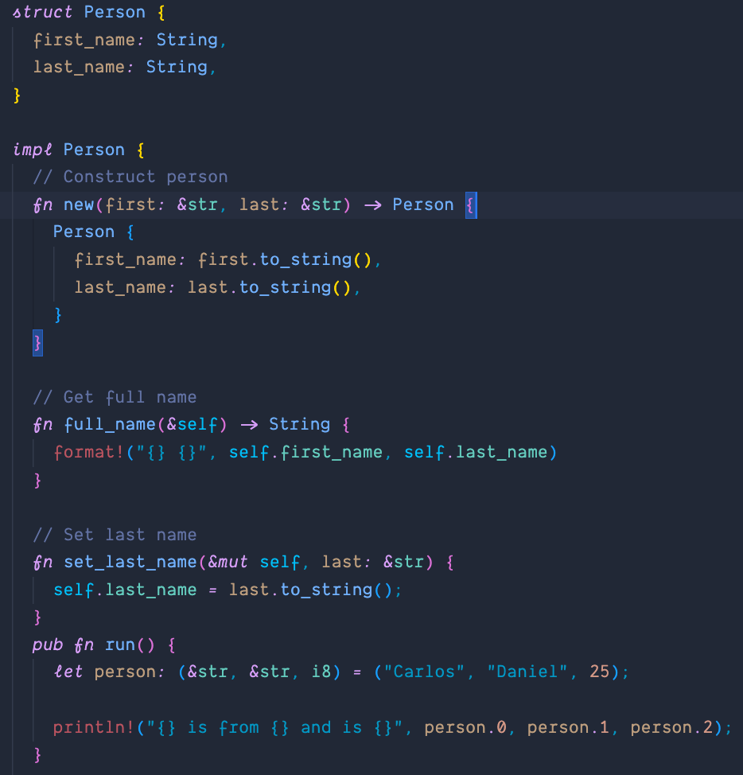
</br>
</br>
<h3>JavaScript:</h3>

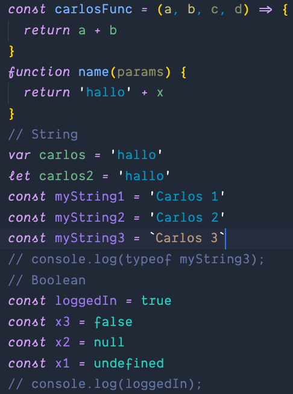
</br>
</br>
<h3>Python:</h3>

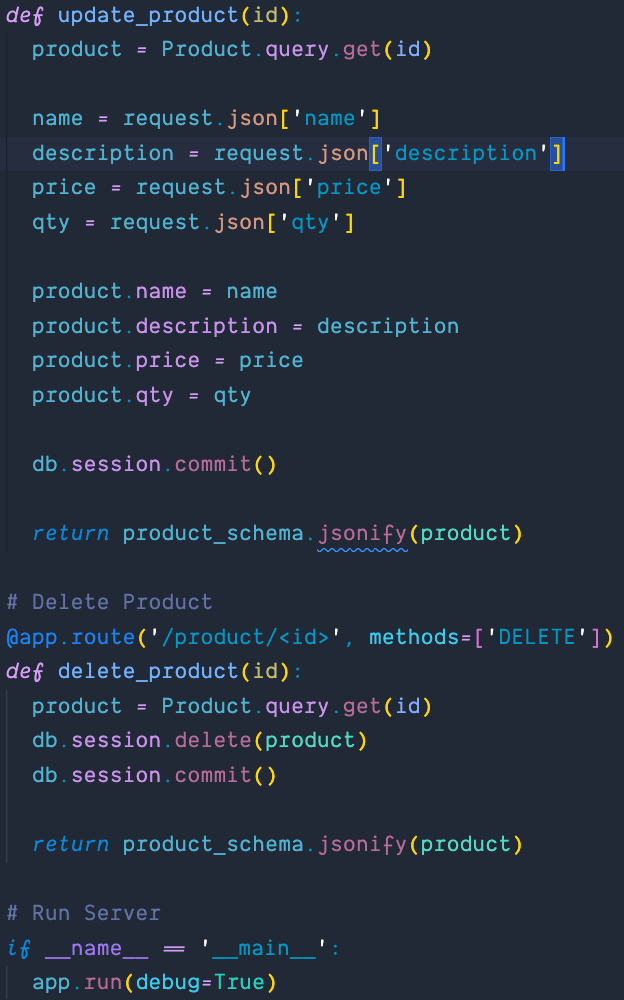
</br>
</br>
<h3>React:</h3>

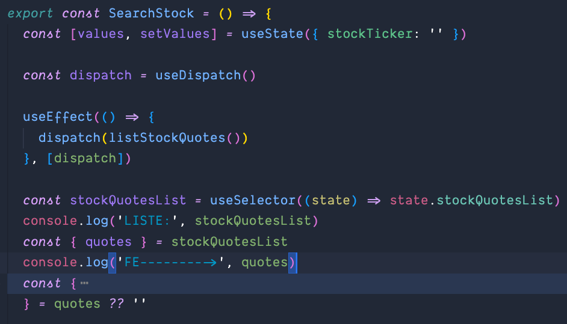
</br>
</br>
<h3>TypeScript:</h3>

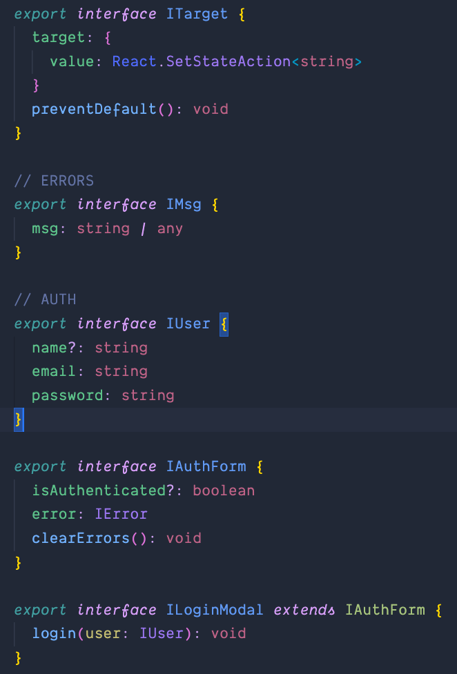
</br>
</br>
<h3>CSS:</h3>

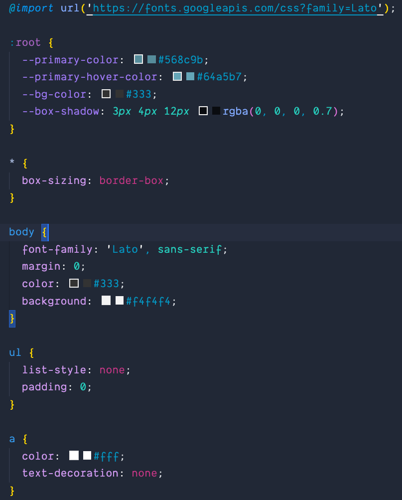
</br>
</br>
<h3>SCSS:</h3>

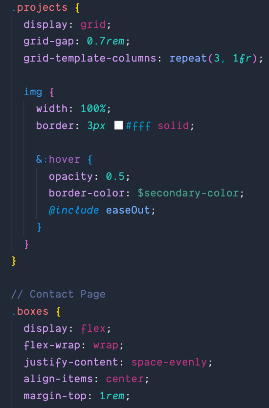
</br>
</br>
___
</br>

<p>🚀 Recommended Settings: / Empfohlene Einstellungen:</p>

```javascript
{
  "workbench.colorTheme": "Altered Matter",
  "editor.fontFamily": "Fira Code, Menlo, Monaco",
  "editor.fontSize": 16,
  "editor.lineHeight": 25,
  "editor.letterSpacing": 0.2,
  "files.trimTrailingWhitespace": true,
  "editor.fontWeight": "400",
  "editor.cursorWidth": 2,
  "editor.cursorBlinking": "smooth",
  "editor.renderWhitespace": "none",
}
```
</br>
<p align=center>Thanks: / Danke an:</p>
<p align=center>🌹 A special Thank You to my wife for her awesome support!</p>
<p align=center>🌹 Ein Besonderer Dank an meine liebe Frau für ihre Unterstüzung!</p>

___

</br>

Created by Carlos from:
[Tech with Carlos](https://www.youtube.com/channel/UCWx7qglu2VAnkBj8M_SsRbg/featured)